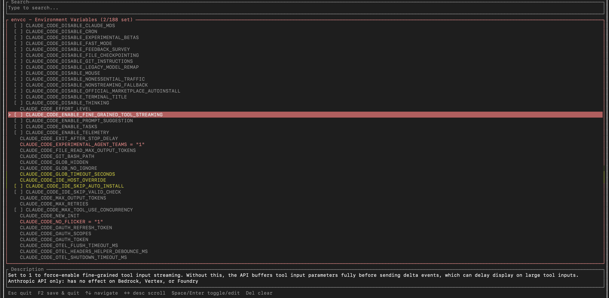

# envcc

A terminal UI for configuring [Claude Code](https://claude.ai/code) environment variables.

Browse, search, and toggle all available Claude Code env vars from a single TUI. Settings are saved to `.claude/settings.json` so they're picked up automatically when you run Claude Code.



## Install

**npm / npx** (no install needed):
```sh
npx envcc
```

**Cargo**:
```sh
cargo install envcc
```

**From source**:
```sh
git clone https://github.com/niewinny/envcc.git
cd envcc
cargo install --path .
```

## Usage

Run `envcc` in any project directory:

```sh
envcc
```

- Type to search/filter variables
- **Up/Down** arrows to navigate the list
- **Space/Enter** to toggle booleans or edit string/integer values
- **Del** to clear a value
- **Left/Right** arrows to scroll the description
- **F2** to save and quit
- **Esc** to quit (prompts to save if there are changes)
- **Backspace** to clear search

Settings are saved to `.claude/settings.json` under the `env` key. Run `envcc` again to modify existing settings - everything is preserved.

## How it works

1. Fetches the latest environment variables from the [official Claude Code docs](https://code.claude.com/docs/en/env-vars)
2. Caches them locally at `~/.cache/envcc/vars.json` for offline use
3. On next run, checks if the docs have changed and updates the cache
4. Reads existing `.claude/settings.json` if present
5. Lets you browse and configure env vars through the TUI
6. Saves only the `env` key - all other settings (permissions, hooks, etc.) are preserved

## Example output

```json
{
  "env": {
    "CLAUDE_CODE_DISABLE_THINKING": "1",
    "CLAUDE_CODE_EXPERIMENTAL_AGENT_TEAMS": "1",
    "ANTHROPIC_MODEL": "claude-sonnet-4-6-20250514"
  }
}
```

## License

MIT
